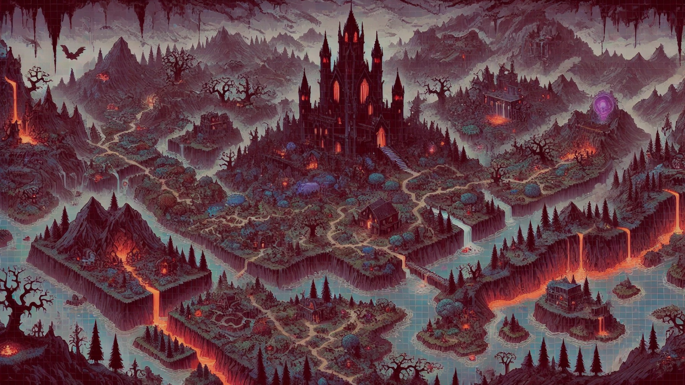
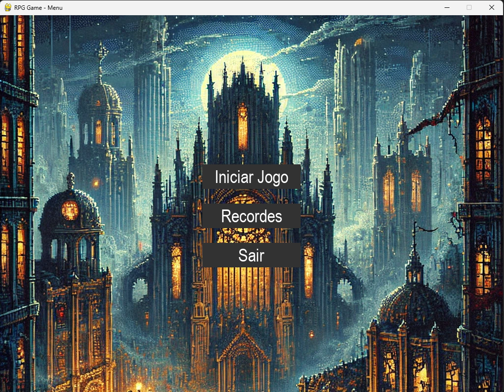
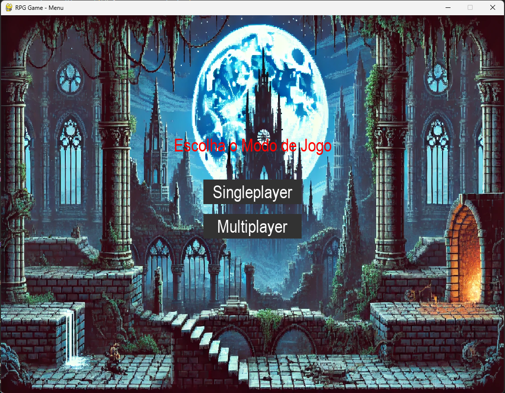
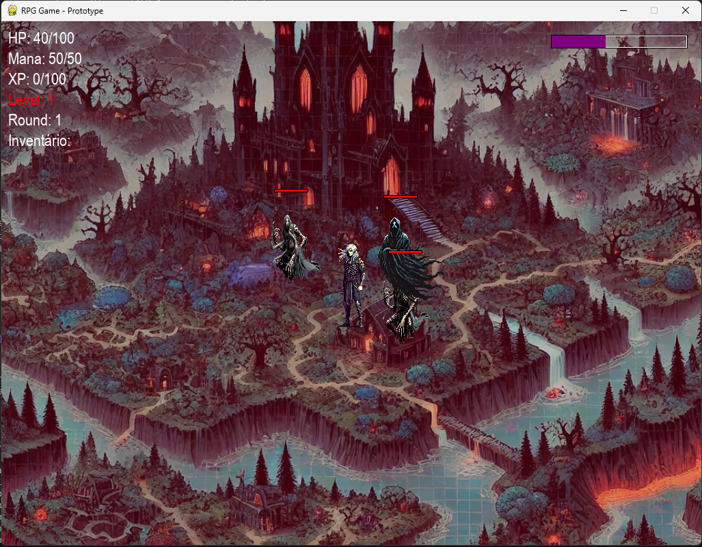
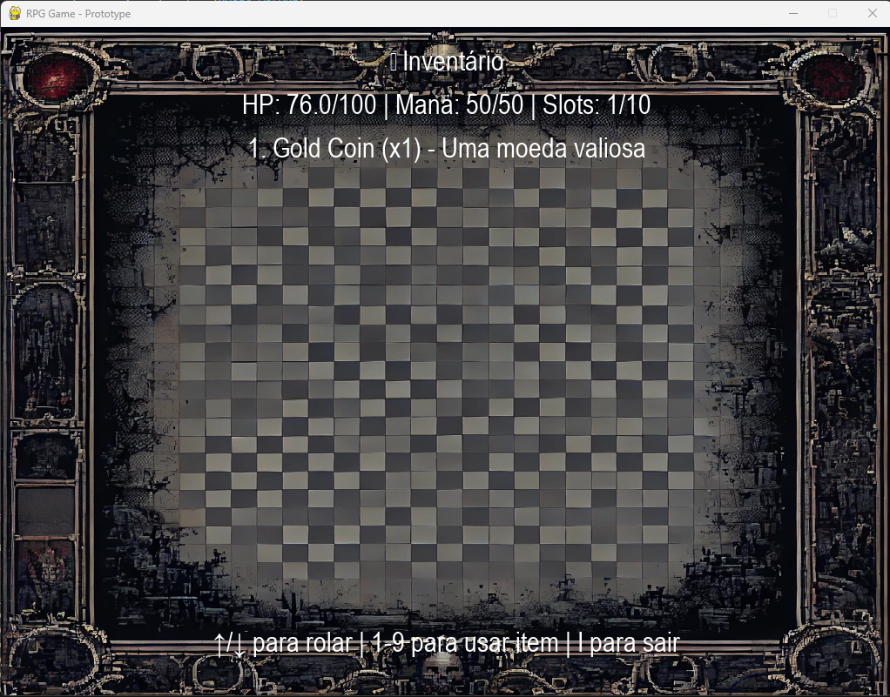
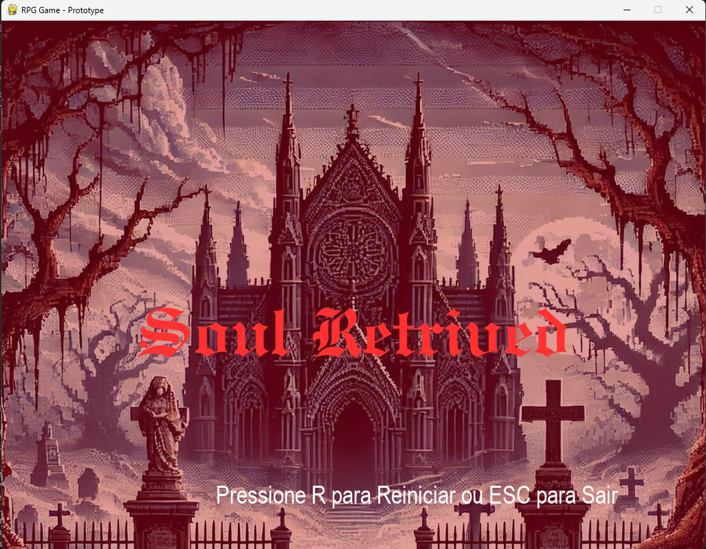

# RPG_game.beta
RPG Game in Python

# 🎮 RPG game (Python + Pygame)



Um protótipo inspirado em *Diablo 3* feito em **Python** usando **Pygame**, com movimentação, IA de inimigos, ataques, inventário e integração com banco de dados MongoDB.

---

## 📌 Índice
- [Visão Geral](#visão-geral)
- [Funcionalidades](#funcionalidades)
- [Tecnologias Usadas](#tecnologias-usadas)
- [Estrutura do Projeto](#estrutura-do-projeto)
- [Como Executar](#como-executar)
- [Capturas de Tela](#capturas-de-tela)
- [Próximos Passos](#próximos-passos)

---

## 🎯 Visão Geral
Este projeto é um protótipo de um **RPG de ação**, semelhante a *Diablo*, com:
- **Movimentação do jogador** com controles `W, A, S, D`
- **Ataques básicos** (`SPACE`)
- **Ataque especial** (`F`)
- **Defesa de golpes** (`Q`)
- **Inventáriopara armazenar itens** (`I`)
- **Inimigos que perseguem o jogador**
- **Sistema de inventário**
- **Banco de dados MongoDB para gerenciamento de itens** ('Em breve...')

---

## ⚔️ Funcionalidades
✅ **Personagem principal movimentável**  
✅ **Inimigos com IA simples (seguem o jogador)**  
✅ **Ataques corpo a corpo (com cooldown)**  
✅ **Inventário para armazenar itens**  
✅ **Banco de dados MongoDB para registrar os itens**  
✅ **Interface HUD com HP, Mana e Inventário**  

---

## 🛠 Tecnologias Usadas
- **Python 3.11**
- **Pygame 2.6.1** (para gráficos e jogabilidade)
- **MongoDB** (para armazenar os itens do jogo)

---

## 💂🏻🛡️ Capturas de Tela

### 📌 Menu Inicial


### 🎮 Seleção de Modo de Jogo


### 🔥 Gameplay


### 🧑‍🎒 Inventário


### ☠️ Tela de Game Over


---

## 📂 Estrutura do Projeto
```plaintext
Jogo/
├── assets/                 # Imagens do jogo
│   ├── background.png
│   ├── enemy.png
│   ├── item.png
│   ├── player.png
│   ├── player1.png
│   ├── player2.png
├── enemy.py                # Classe dos inimigos Normais
├── enemy2.py               # Classe dos inimigos Rápidos
├── enemy3.py               # Classe dos inimigos Tanques
├── enemyboss.py            # Classe dos inimigos Boss
├── menu.py                 # Interface do menu
├── camera.py               # Classe da câmera
├── npcs.py                 # Classe dos NPCs
├── inventory.py            # Sistema de inventário
├── inventory_db.py         # Banco de dados dos itens
├── item.py                 # Definição dos itens coletáveis
├── level.py                # Gerenciamento do mapa/nível
├── main.py                 # Arquivo principal do jogo
├── player.py               # Classe do jogador
└── settings.py             # Configurações globais do jogo
```

---

## ▶️ Como Executar

### 1️⃣ Clone o repositório
```sh
git clone https://github.com/antonioreal97/RPG_game.beta.git
cd RPG_game.beta
```

### 2️⃣ Instale as dependências
Certifique-se de que tem o Python instalado e instale o Pygame:
```sh
pip install pygame
pip install pymongo
pip install python-dotenv
```

### 3️⃣ Configuração do Ambiente

Para configurar as variáveis de ambiente necessárias, crie um arquivo .env na raiz do projeto e adicione as seguintes linhas:

```sh
MONGO_URI=YOUR_MONGO_URI
DB_NAME=YOUR_CLUSTER
COLLECTION_NAME=items
```
Isso garantirá que o jogo consiga acessar corretamente o banco de dados MongoDB.


### 🔧 Criando seu próprio ambiente MongoDB

Se desejar rodar o jogo localmente com seu próprio banco de dados MongoDB, siga estas etapas:

Adicione sua string de conexão no formato:
```sh
mongodb+srv://<username>:<password>@<your-cluster>.mongodb.net/?retryWrites=true&w=majority
```

Substitua <username> e <password> pelos seus dados.

Atualize o arquivo .env com sua string de conexão personalizada.

Após essas configurações, seu ambiente estará pronto para rodar o jogo com seu próprio banco de dados MongoDB.

### 4️⃣ Execute o Jogo

```sh
python main.py
```
